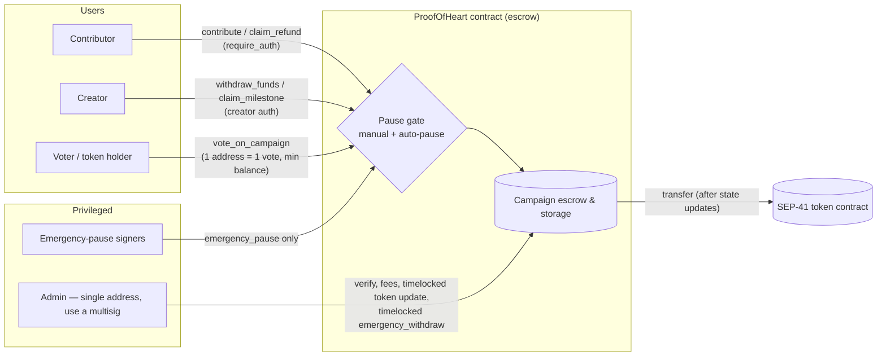

# Security Policy

## Supported Versions

The following versions of ProofOfHeart-stellar are currently receiving security updates:

| Version | Supported          |
| ------- | ------------------ |
| 0.1.x   | :white_check_mark: |

## Reporting a Vulnerability

We take security vulnerabilities seriously. If you discover a security issue in ProofOfHeart-stellar, please **do not** open a public GitHub issue.

### How to Report

Send a detailed report to:

**Email:** security@proofofheart.io (domain confirmed: proofofheart.io)

Please include the following in your report:

- A clear description of the vulnerability
- Steps to reproduce the issue
- The potential impact (e.g. fund loss, unauthorised access, overflow)
- Any proof-of-concept code or transaction examples if applicable

### What to Expect

- **Acknowledgement:** We will acknowledge receipt of your report within **48 hours**.
- **Status updates:** We will keep you informed of our progress and expected timeline.
- **Resolution:** We aim to resolve critical vulnerabilities within **7 days** and non-critical issues within **30 days**.
- **Credit:** With your permission, we will credit you in the release notes once the vulnerability is fixed.

### Severity Definitions

We triage reports using the following severity levels:

| Severity | Definition | Example |
|----------|------------|---------|
| **P0 — Critical** | Direct loss or theft of funds, permanent freezing of funds, or a way to bypass admin/auth controls. Can be exploited without special privileges. | Draining escrowed contributions, minting unauthorised withdrawals, admin impersonation. |
| **P1 — High** | Significant contract malfunction that does not directly move funds but breaks a core invariant (e.g. accounting, voting, campaign lifecycle) or can be chained into a P0. | Incorrect fee/revenue-share accounting, vote-count manipulation, denial of service on a core entrypoint. |
| **P2 — Medium/Low** | Limited-impact bugs, edge cases, or hardening opportunities that do not put funds or contract integrity at immediate risk. | Missing input validation with no exploitable consequence, gas/resource inefficiencies, informational issues. |

### Responsible Disclosure Timeline

We ask reporters to follow **coordinated disclosure**:

1. Report the issue privately via the email above — do not open a public issue, PR, or forum post describing the vulnerability.
2. We will work with you to validate, reproduce, and fix the issue.
3. We request **90 days** from the initial report before any public disclosure, to give us time to ship and deploy a fix. This window can be shortened by mutual agreement (e.g. once a fix is live and users have had time to upgrade) or extended if the fix requires unusual coordination (e.g. a contract migration).
4. If 90 days pass without a resolution or agreed extension, the reporter may disclose publicly, but we ask that you still coordinate the exact timing and content with us where possible.

### Bug Bounty & Rewards Scope

Security reports targeting core Soroban contract logic in `src/` are evaluated for rewards and public accreditation:

- **In-Scope Contracts & Entrypoints** (public methods of `ProofOfHeart` in `src/lib.rs`):
  - `contribute()`, `batch_contribute()`, `claim_refund()`, `withdraw_funds()`, `withdraw_reserve()`, `claim_milestone()` — Campaign escrow & asset accounting
  - `deposit_revenue()`, `claim_revenue()`, `claim_creator_revenue()` — Revenue-share accounting
  - `vote_on_campaign()`, `verify_campaign()`, `verify_campaign_with_votes()` — Governance & voting invariants
  - Admin entrypoints (`pause`, `update_platform_fee`, `propose_token_update` / `accept_token_update`, `initiate_admin_transfer`, `emergency_withdraw`, …) and the storage layer in `src/storage.rs`
- **Reward Tiers**:
  - **P0 Critical** (Direct fund drain / auth bypass): Eligible for up to $2,500 USDC bounty + release notes credit.
  - **P1 High** (State corruption / fee breakdown): Eligible for up to $1,000 USDC bounty + release notes credit.
  - **P2 Medium/Low**: Eligible for public credit in release notes.

### Audits

No formal third-party security audit has been conducted on this contract to date. Findings from internal and community review are tracked in the [Security Findings & Remediation Tracking Matrix](#security-findings--remediation-tracking-matrix). Given the contract handles escrowed funds, we recommend treating it as **unaudited** and exercising appropriate caution until an audit is completed.

### Scope

This policy covers the on-chain Soroban smart contract (`src/`) and official tooling in this repository. Frontend integrations or third-party services built on top of the contract are out of scope unless the vulnerability originates from contract logic itself.

### Out of Scope

- Vulnerabilities in dependencies outside our control (e.g. `soroban-sdk`)
- Issues already publicly disclosed
- Theoretical attacks without a realistic exploit path

## Security Findings & Remediation Tracking Matrix

This matrix tracks every security-relevant finding reported against this repository and how it was fixed. These are **internal and community findings** (GitHub issues). They are not the output of a formal third-party audit (see [Audits](#audits)).

Severities use the [definitions above](#severity-definitions). Findings from before those definitions existed were classified afterwards. Where several issues reported the same problem, they share one row, and the first issue listed is the canonical one.

**Status key:** ✅ Resolved · ⚠️ Partially mitigated / mitigated · 🟡 Accepted risk · 🔴 Open

| ID | Issue(s) | Finding | Severity | Component | Status | Fix PR(s) |
|----|----------|---------|----------|-----------|--------|-----------|
| SEC-01 | [#93](https://github.com/Iris-IV/ProofOfHeart-stellar/issues/93) | `init` could be called again, overwriting admin and token | P0 | `admin.rs` | ✅ Resolved | [#149](https://github.com/Iris-IV/ProofOfHeart-stellar/pull/149) |
| SEC-02 | [#95](https://github.com/Iris-IV/ProofOfHeart-stellar/issues/95) | `claim_revenue` did not require the contributor's authorization | P0 | `revenue.rs` | ✅ Resolved | [#149](https://github.com/Iris-IV/ProofOfHeart-stellar/pull/149) |
| SEC-03 | [#164](https://github.com/Iris-IV/ProofOfHeart-stellar/issues/164) | Creator could cancel after the goal was met (rug pull) | P0 | `campaigns/cancel.rs` | ✅ Resolved | [#280](https://github.com/Iris-IV/ProofOfHeart-stellar/pull/280), [#577](https://github.com/Iris-IV/ProofOfHeart-stellar/pull/577) |
| SEC-04 | [#315](https://github.com/Iris-IV/ProofOfHeart-stellar/issues/315), [#372](https://github.com/Iris-IV/ProofOfHeart-stellar/issues/372) | `resume_campaign` lifted the global pause, so any creator could undo an admin pause | P0 | `admin.rs` | ✅ Resolved | [#334](https://github.com/Iris-IV/ProofOfHeart-stellar/pull/334), [#396](https://github.com/Iris-IV/ProofOfHeart-stellar/pull/396) |
| SEC-05 | [#377](https://github.com/Iris-IV/ProofOfHeart-stellar/issues/377) | Voting `set_params` ignored its admin argument — anyone could change quorum | P0 | `voting.rs` | ✅ Resolved | [#394](https://github.com/Iris-IV/ProofOfHeart-stellar/pull/394) |
| SEC-06 | [#469](https://github.com/Iris-IV/ProofOfHeart-stellar/issues/469), [#448](https://github.com/Iris-IV/ProofOfHeart-stellar/issues/448) | Token-weighted votes used live balance — flash loans inflated approval weight | P0 | `voting.rs` | ✅ Resolved (1-address-1-vote) | [#689](https://github.com/Iris-IV/ProofOfHeart-stellar/pull/689) |
| SEC-07 | [#404](https://github.com/Iris-IV/ProofOfHeart-stellar/issues/404), [#467](https://github.com/Iris-IV/ProofOfHeart-stellar/issues/467) | Auto-review workflow merged with `--admin`, bypassing branch protection | P0 | CI | ✅ Resolved | [#405](https://github.com/Iris-IV/ProofOfHeart-stellar/pull/405), [#696](https://github.com/Iris-IV/ProofOfHeart-stellar/pull/696) |
| SEC-08 | [#472](https://github.com/Iris-IV/ProofOfHeart-stellar/issues/472) | AI auto-reviewer ran on `pull_request_target` with access to secrets | P0 | CI | ✅ Resolved | [#570](https://github.com/Iris-IV/ProofOfHeart-stellar/pull/570) |
| SEC-09 | [#400](https://github.com/Iris-IV/ProofOfHeart-stellar/issues/400) | Duplicate `Error` discriminant `39` broke the build | P0 | `errors.rs` | ✅ Resolved | [#406](https://github.com/Iris-IV/ProofOfHeart-stellar/pull/406) |
| SEC-10 | [#76](https://github.com/Iris-IV/ProofOfHeart-stellar/issues/76) | No systematic reentrancy protection on withdrawals | P1 | withdrawals | ✅ Resolved | [#154](https://github.com/Iris-IV/ProofOfHeart-stellar/pull/154) |
| SEC-11 | [#557](https://github.com/Iris-IV/ProofOfHeart-stellar/issues/557), [#546](https://github.com/Iris-IV/ProofOfHeart-stellar/issues/546) | `claim_refund` reentrancy with a malicious token contract | P1 | `contributions.rs` | ✅ Resolved | [#681](https://github.com/Iris-IV/ProofOfHeart-stellar/pull/681) |
| SEC-12 | [#57](https://github.com/Iris-IV/ProofOfHeart-stellar/issues/57) | Voting had no token-based sybil resistance | P1 | `voting.rs` | ✅ Resolved, later superseded by SEC-06 | [#90](https://github.com/Iris-IV/ProofOfHeart-stellar/pull/90) |
| SEC-13 | [#177](https://github.com/Iris-IV/ProofOfHeart-stellar/issues/177) | Vote de-duplication by address rather than balance snapshot | P1 | `voting.rs` | ✅ Resolved (commit `384338e`) | — |
| SEC-14 | [#160](https://github.com/Iris-IV/ProofOfHeart-stellar/issues/160) | Revenue-share base not adjusted after refunds | P1 | `revenue.rs` | ✅ Resolved | [#397](https://github.com/Iris-IV/ProofOfHeart-stellar/pull/397) |
| SEC-15 | [#168](https://github.com/Iris-IV/ProofOfHeart-stellar/issues/168) | `claim_revenue` could panic on `i128` overflow for large pools | P1 | `revenue.rs` | ✅ Resolved | [#246](https://github.com/Iris-IV/ProofOfHeart-stellar/pull/246) |
| SEC-16 | [#174](https://github.com/Iris-IV/ProofOfHeart-stellar/issues/174) | Single-step `update_admin` — a typo would brick the contract | P1 | `admin.rs` | ✅ Resolved (two-step transfer) | [#242](https://github.com/Iris-IV/ProofOfHeart-stellar/pull/242) |
| SEC-17 | [#259](https://github.com/Iris-IV/ProofOfHeart-stellar/issues/259) | Anomaly auto-pause returned `Ok(())` instead of `ContractPaused` | P1 | anomaly detection | ✅ Resolved | [#282](https://github.com/Iris-IV/ProofOfHeart-stellar/pull/282) |
| SEC-18 | [#376](https://github.com/Iris-IV/ProofOfHeart-stellar/issues/376) | Burst counter in temporary storage could expire mid-block | P1 | anomaly detection | ✅ Resolved | [#393](https://github.com/Iris-IV/ProofOfHeart-stellar/pull/393) |
| SEC-19 | [#268](https://github.com/Iris-IV/ProofOfHeart-stellar/issues/268) | `get_platform_stats` unbounded O(n) scan (DoS) | P1 | `queries.rs` | ✅ Resolved | [#278](https://github.com/Iris-IV/ProofOfHeart-stellar/pull/278) |
| SEC-20 | [#388](https://github.com/Iris-IV/ProofOfHeart-stellar/issues/388) | Admin recovery functions blocked while paused | P1 | `admin.rs` | ✅ Resolved | [#425](https://github.com/Iris-IV/ProofOfHeart-stellar/pull/425) |
| SEC-21 | [#407](https://github.com/Iris-IV/ProofOfHeart-stellar/issues/407), [#470](https://github.com/Iris-IV/ProofOfHeart-stellar/issues/470) | `accept_token_update` stranded campaign balances in the old token | P1 | `admin.rs` | ✅ Resolved (per-campaign currency) | [#422](https://github.com/Iris-IV/ProofOfHeart-stellar/pull/422), [#424](https://github.com/Iris-IV/ProofOfHeart-stellar/pull/424), [#613](https://github.com/Iris-IV/ProofOfHeart-stellar/pull/613) |
| SEC-22 | [#532](https://github.com/Iris-IV/ProofOfHeart-stellar/issues/532) | `require_auth()` on the wrong scope — nested auth consumable by another call | P1 | auth | ✅ Resolved | [#582](https://github.com/Iris-IV/ProofOfHeart-stellar/pull/582) |
| SEC-23 | [#559](https://github.com/Iris-IV/ProofOfHeart-stellar/issues/559), [#548](https://github.com/Iris-IV/ProofOfHeart-stellar/issues/548) | `update_platform_fee` had no maximum — overflow risk | P1 | `admin.rs` | ✅ Resolved | [#571](https://github.com/Iris-IV/ProofOfHeart-stellar/pull/571) |
| SEC-24 | [#473](https://github.com/Iris-IV/ProofOfHeart-stellar/issues/473) | `purge_voting_state` could clear quorum-ready votes | P1 | `admin.rs` | ✅ Resolved — purge only allowed once funds are withdrawn or the campaign is cancelled | — |
| SEC-25 | [#468](https://github.com/Iris-IV/ProofOfHeart-stellar/issues/468), [#447](https://github.com/Iris-IV/ProofOfHeart-stellar/issues/447) | Admin is a single key controlling fee override, force-verify, pause and token migration | P1 | admin | ⚠️ Partially mitigated — see note 1 | — |
| SEC-26 | [#166](https://github.com/Iris-IV/ProofOfHeart-stellar/issues/166) | Description could be rewritten after contributions or after goal met | P2 | `campaigns/update.rs` | ✅ Resolved | [#250](https://github.com/Iris-IV/ProofOfHeart-stellar/pull/250) |
| SEC-27 | [#416](https://github.com/Iris-IV/ProofOfHeart-stellar/issues/416), [#440](https://github.com/Iris-IV/ProofOfHeart-stellar/issues/440), [#456](https://github.com/Iris-IV/ProofOfHeart-stellar/issues/456) | Title/description editable after verification (bait-and-switch) | P2 | `campaigns/update.rs` | ✅ Resolved | [#422](https://github.com/Iris-IV/ProofOfHeart-stellar/pull/422), [#934](https://github.com/Iris-IV/ProofOfHeart-stellar/pull/934) |
| SEC-28 | [#189](https://github.com/Iris-IV/ProofOfHeart-stellar/issues/189) | `update_admin` checked admin identity after `require_auth` | P2 | `admin.rs` | ✅ Resolved | [#249](https://github.com/Iris-IV/ProofOfHeart-stellar/pull/249) |
| SEC-29 | [#558](https://github.com/Iris-IV/ProofOfHeart-stellar/issues/558), [#547](https://github.com/Iris-IV/ProofOfHeart-stellar/issues/547) | No upper bound on `extend_campaign_deadline` days | P2 | `campaigns/update.rs` | ✅ Resolved — `CAMPAIGN_EXTENSION_MAX_DAYS` enforced | — |
| SEC-30 | [#451](https://github.com/Iris-IV/ProofOfHeart-stellar/issues/451) | Rounding in `claim_creator_revenue` under-pays the last claimant | P2 | `revenue.rs` | ⚠️ Mitigated — creator share computed directly; rounding dust stays in the contract | — |
| SEC-31 | [#474](https://github.com/Iris-IV/ProofOfHeart-stellar/issues/474) | Event payloads exposed internal fee amounts | P2 | events | ✅ Resolved | [#589](https://github.com/Iris-IV/ProofOfHeart-stellar/pull/589) |
| SEC-32 | [#471](https://github.com/Iris-IV/ProofOfHeart-stellar/issues/471), [#450](https://github.com/Iris-IV/ProofOfHeart-stellar/issues/450) | CI did not run `cargo fmt --check`, `clippy` or `cargo audit` | P2 | CI | ✅ Resolved | [#730](https://github.com/Iris-IV/ProofOfHeart-stellar/pull/730) |
| SEC-33 | [#533](https://github.com/Iris-IV/ProofOfHeart-stellar/issues/533) | WASM build not reproducible — deployed binary can't be matched to source | P2 | build | ⚠️ Partially resolved — see note 2 | [#724](https://github.com/Iris-IV/ProofOfHeart-stellar/pull/724) |
| SEC-34 | — | `RUSTSEC-2025-0001` (soroban-token-sdk) ignored in CI audit | P2 | CI / deps | 🟡 Accepted risk — see note 3 | — |

**Notes**

1. **SEC-25 (single admin key).** Mitigations in place: two-step admin transfer (`initiate_admin_transfer` / `accept_admin_transfer`), a configurable timelock on token migration (`propose_token_update` → `accept_token_update`, `get_token_update_delay_secs`), a 7-day timelock on `emergency_withdraw`, and a separate emergency-pause signer set (`set_emergency_pause_signers` / `emergency_pause`). The admin is still one address, so deployers should set it to a multisig account or a contract.
2. **SEC-33 (reproducible builds).** `make build-docker` builds inside a pinned container, but the image is `stellar/rs-soroban-sdk:20.1.0` while `Cargo.toml` pins `soroban-sdk = "=22.0.11"`. The image tag should be brought in line with the SDK before the build is relied on for verification. The finding stays open until then.
3. **SEC-34 (accepted advisory).** The CI `audit` job ignores `RUSTSEC-2025-0001`. Its justification says the vulnerable version is pinned by soroban-sdk 20.1.0. The contract now uses soroban-sdk 22.0.11, so the ignore should be re-checked and removed if it no longer applies.

### Adding a finding

1. Report it privately first, as described in [How to Report](#how-to-report). Open a public issue only after a fix ships, or once the disclosure window has passed.
2. Add a row with the next `SEC-NN` id, the issue number(s), a one-line description of the finding, its severity and the affected module.
3. Update **Status** and **Fix PR(s)** when the fix merges. Don't delete rows: resolved findings are the audit history.

### Security architecture at a glance



### Verifying the fixes yourself

**Checks-effects-interactions.** Every payout path finishes all its state writes before the external token call. Here is `claim_refund` (`src/contributions.rs`, abridged):

```rust
contributor.require_auth();
require_not_paused(env)?;
// ... eligibility checks ...
remove_contribution(env, campaign_id, &contributor);      // effects first
remove_revenue_claimed(env, campaign_id, &contributor);
decrement_contributor_count(env, campaign_id)?;
// ... accounting updates ...
let client = campaign_token_client(env, campaign_id);
client.transfer(&env.current_contract_address(), &contributor, &amount); // interaction last
```

A re-entrant call from a malicious token then sees a zero contribution and fails with `NoFundsToWithdraw` (SEC-11).

**Inspect live security state with the Stellar CLI** (read-only; `--source` can be any funded identity):

```bash
ID=<CONTRACT_ID>; NET=testnet   # or mainnet
stellar contract invoke --id $ID --network $NET --source me -- is_paused
stellar contract invoke --id $ID --network $NET --source me -- get_admin
stellar contract invoke --id $ID --network $NET --source me -- get_pending_admin
stellar contract invoke --id $ID --network $NET --source me -- get_emergency_pause_signers
stellar contract invoke --id $ID --network $NET --source me -- get_token_update_delay_secs
stellar contract invoke --id $ID --network $NET --source me -- get_platform_fee
```

**Compare a deployed binary with source** (SEC-33; see note 2 about the image tag):

```bash
make build-docker
sha256sum $(find target -path '*release*' -name proof_of_heart.wasm)
stellar contract fetch --id $ID --network $NET --out-file deployed.wasm
sha256sum deployed.wasm
```

## Voting Sybil-Resistance Assumptions

Community verification uses a token-gated, **one-address-one-vote** model (`src/voting.rs`, since #469):

- **Eligibility:** an address must hold at least the configured minimum balance of the platform token (`get_min_voting_balance`) at the time of voting, and may vote once per campaign (`AlreadyVoted`).
- **Quorum:** counts _addresses_ that voted (approve + reject), compared against `get_min_votes_quorum`.
- **Threshold:** approval is computed from **vote counts**, not token balances, against `get_approval_threshold_bps` or the per-category override (`get_category_voting_threshold`). Balances are only an eligibility gate, so a flash-loaned balance cannot inflate voting weight.

Security assumptions and limitations:

- This mechanism is **not sybil-resistant**: anyone holding enough tokens can split them across many addresses that each meet the minimum balance, and every address gets one vote. That lets them inflate both the vote count and the approval ratio. The minimum voting balance is the main economic cost of doing this.
- The model assumes the token's distribution and issuance are outside the contract's control; if token minting is centralized or cheaply obtainable, governance can be captured.
- Admin verification (`verify_campaign`, `verify_campaigns`) is a privileged path; users should treat the stored admin as a trust assumption for campaign verification.

## Disclosure Policy

We follow a **coordinated disclosure** process. Please allow us reasonable time to investigate and patch the vulnerability before making any public disclosure.

Thank you for helping keep ProofOfHeart-stellar and its users safe.
