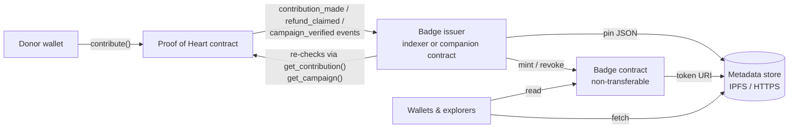

# Donor Badges & NFT Metadata Guidelines

> **Status:** guideline / standard. The Proof of Heart contract does **not**
> mint badges or NFTs itself — there is no badge storage, mint or transfer
> entry point in `src/`. This document defines how a **companion badge
> issuer** (a separate Soroban contract, or an off-chain indexer that mints
> into one) should derive soulbound donor badges from data the Proof of Heart
> contract already exposes, and the metadata schema those badges must use so
> wallets, explorers and indexers can read them consistently.
>
> Every contract function, event and field referenced below was checked
> against the source at the commit this file was added in.

## Contents

- [Architecture](#architecture)
- [What the contract exposes](#what-the-contract-exposes)
- [Badge types and eligibility](#badge-types-and-eligibility)
- [Soulbound rules](#soulbound-rules)
- [Metadata schema (`proof-of-heart-badge/v1`)](#metadata-schema-proof-of-heart-badgev1)
- [Verifying eligibility with the Soroban CLI](#verifying-eligibility-with-the-soroban-cli)
- [Reading eligibility from a companion contract (Rust)](#reading-eligibility-from-a-companion-contract-rust)
- [Indexer checklist](#indexer-checklist)

## Architecture



Events are the trigger; **contract reads are the source of truth**. An issuer
must never mint from an event alone — it re-reads the contract state first
(see [Indexer checklist](#indexer-checklist)), because a later refund removes
the contribution the event reported.

## What the contract exposes

### Events

| Event | Topics | Data | Emitted by |
|---|---|---|---|
| `contribution_made` | `("contribution_made", campaign_id: u32, contributor: Address)` | `amount: i128` | `contribute()` and `batch_contribute()` — `src/contributions.rs` |
| `refund_claimed` | `("refund_claimed", campaign_id: u32, contributor: Address)` | `amount: i128` | `claim_refund()` — `src/contributions.rs` |
| `campaign_verified` (admin) | `("campaign_verified", campaign_id: u32)` | `()` | admin verification — `src/voting.rs` |
| `campaign_verified` (community) | `("campaign_verified", campaign_id: u32)` | `approve_votes: u32` | vote finalisation — `src/voting.rs` |

`amount` is in the campaign token's smallest unit (the token set at
`init()`; read its `decimals()` to display it).

### Read functions

| Function | Returns | Badge use |
|---|---|---|
| `get_contribution(campaign_id: u32, contributor: Address)` | `i128` — current total, `0` if none | Eligibility check. `claim_refund()` **removes** the record, so this returns `0` after a refund. |
| `get_campaign(campaign_id: u32)` | `Result<Campaign, Error>` | `category`, `is_verified`, `is_cancelled`, `funds_withdrawn`, `title` |
| `get_contributor_portfolio(contributor: Address, start: u32, limit: u32)` | `(Vec<(u32, i128, String, bool)>, u32)` | One entry per campaign the donor currently backs: `(campaign_id, amount, status, refundable)`; the second value is the next cursor (`0` = done). |
| `get_campaign_stats(campaign_id: u32)` | `CampaignStats` | `contributor_count`, `top_contributor`, `avg_contribution` |

`status` in the portfolio is one of `"cancelled"`, `"withdrawn"`,
`"inactive"`, `"verified"` or `"active"` (first match wins, in that order).
`refundable` is `true` when the campaign is cancelled, or its deadline has
passed without reaching the funding goal.

`Campaign.category` is the `Category` enum: `Learner = 0`,
`EducationalStartup = 1`, `Educator = 2`, `Publisher = 3`.

## Badge types and eligibility

All badges are keyed by `(holder, badge_type, campaign_id)`; a holder can
hold at most one badge of each type per campaign (campaign-less types use
`campaign_id = 0`).

| `badge_type` | Awarded when | Revoked when |
|---|---|---|
| `supporter` | `get_contribution(campaign_id, holder) > 0` | the contribution drops to `0` (a `refund_claimed` for that pair) |
| `verified_supporter` | `supporter` **and** `get_campaign(campaign_id).is_verified` | as `supporter` |
| `campaign_completed` | `supporter` **and** the campaign reached `funds_withdrawn = true` (portfolio status `"withdrawn"`) | never — the campaign delivered; refunds are no longer possible |
| `category_champion` | the holder backs ≥ 3 distinct campaigns of the same `category` (from `get_contributor_portfolio`) | a refund drops the count below 3 |

Do **not** award on a campaign whose portfolio `status` is `"cancelled"` or
while `refundable` is `true` for badges other than `supporter`: the donor can
still claim their contribution back.

## Soulbound rules

Donor badges represent something the holder *did*; they are not assets.

1. **Non-transferable.** The badge contract must reject every transfer and
   approval (no `transfer`, `transfer_from`, `approve` that can succeed). If
   the contract implements an NFT interface for wallet compatibility, those
   functions must return an error.
2. **Bound to the contributing address.** `holder` is always the
   `contributor` from the event topics — never a caller-supplied address.
3. **Revocable only by the issuer, only per the table above.** Revocation
   burns the badge; the issuer logs the `refund_claimed` event that caused it.
4. **Idempotent minting.** Replaying the same event must not mint twice
   (key on `(holder, badge_type, campaign_id)`).

## Metadata schema (`proof-of-heart-badge/v1`)

Each badge's token URI resolves to a JSON document conforming to this schema.
Field names follow the widely supported `name` / `description` / `image` /
`attributes` layout so generic NFT wallets render badges without custom code;
the `proof_of_heart` object carries the machine-readable, verifiable data.

```json
{
  "$schema": "https://json-schema.org/draft/2020-12/schema",
  "$id": "https://proofofheart.app/schemas/proof-of-heart-badge-v1.json",
  "title": "Proof of Heart donor badge",
  "type": "object",
  "required": ["name", "description", "image", "soulbound", "standard", "proof_of_heart"],
  "properties": {
    "name": { "type": "string", "maxLength": 64 },
    "description": { "type": "string", "maxLength": 512 },
    "image": { "type": "string", "format": "uri" },
    "soulbound": { "const": true },
    "standard": { "const": "proof-of-heart-badge/v1" },
    "attributes": {
      "type": "array",
      "items": {
        "type": "object",
        "required": ["trait_type", "value"],
        "properties": {
          "trait_type": { "type": "string" },
          "value": { "type": ["string", "number"] }
        }
      }
    },
    "proof_of_heart": {
      "type": "object",
      "required": ["network_passphrase", "contract_id", "holder", "badge_type", "campaign_id", "awarded_at_ledger"],
      "properties": {
        "network_passphrase": { "type": "string" },
        "contract_id": { "type": "string", "pattern": "^C[A-Z2-7]{55}$" },
        "holder": { "type": "string", "pattern": "^G[A-Z2-7]{55}$" },
        "badge_type": { "enum": ["supporter", "verified_supporter", "campaign_completed", "category_champion"] },
        "campaign_id": { "type": "integer", "minimum": 0 },
        "category": { "enum": ["Learner", "EducationalStartup", "Educator", "Publisher"] },
        "amount": { "type": "string", "pattern": "^[0-9]+$", "description": "i128 in token base units, as a string" },
        "token": { "type": "string", "pattern": "^C[A-Z2-7]{55}$" },
        "awarded_at_ledger": { "type": "integer", "minimum": 0 },
        "evidence_tx": { "type": "string", "pattern": "^[0-9a-f]{64}$" }
      }
    }
  }
}
```

Rules:

- `amount` is a **string** — `i128` values exceed JavaScript's safe integer
  range; never emit it as a JSON number.
- `holder`, `campaign_id` and `amount` must match what
  `get_contribution(campaign_id, holder)` returned at `awarded_at_ledger`.
- `evidence_tx` is the hash of the transaction that emitted the triggering
  `contribution_made` (or `campaign_verified`) event.
- Do not put donor PII (names, emails) in metadata — only the Stellar
  address, which is already public on-chain.

Example:

```json
{
  "name": "Verified Supporter — Campaign #12",
  "description": "Backed a community-verified Proof of Heart campaign.",
  "image": "ipfs://bafy.../verified_supporter.png",
  "soulbound": true,
  "standard": "proof-of-heart-badge/v1",
  "attributes": [
    { "trait_type": "Badge", "value": "verified_supporter" },
    { "trait_type": "Campaign", "value": 12 },
    { "trait_type": "Category", "value": "Educator" }
  ],
  "proof_of_heart": {
    "network_passphrase": "Test SDF Network ; September 2015",
    "contract_id": "CDLZFC3SYJYDZT7K67VZ75HPJVIEUVNIXF47ZG2FB2RMQQVU2HHGCYSC",
    "holder": "GBRPYHIL2CI3FNQ4BXLFMNDLFJUNPU2HY3ZMFSHONUCEOASW7QC7OX2H",
    "badge_type": "verified_supporter",
    "campaign_id": 12,
    "category": "Educator",
    "amount": "250000000",
    "token": "CAS3J7GYLGXMF6TDJBBYYSE3HQ6BBSMLNUQ34T6TZMYMW2EVH34XOWMA",
    "awarded_at_ledger": 1234567,
    "evidence_tx": "3f5c...e9a1"
  }
}
```

(Addresses and hashes above are placeholders.)

## Verifying eligibility with the Soroban CLI

Anyone can independently check a badge against the contract. With
`CONTRACT_ID` set to the deployed Proof of Heart contract:

```bash
# Current contribution for a donor on campaign 12 (0 = none, or refunded)
stellar contract invoke --id "$CONTRACT_ID" --network testnet -- \
  get_contribution --campaign_id 12 --contributor "$HOLDER"

# Campaign flags used by verified_supporter / campaign_completed / category
stellar contract invoke --id "$CONTRACT_ID" --network testnet -- \
  get_campaign --campaign_id 12

# Every campaign the donor backs, 50 per page; repeat with the returned
# cursor as --start until it is 0
stellar contract invoke --id "$CONTRACT_ID" --network testnet -- \
  get_contributor_portfolio --contributor "$HOLDER" --start 0 --limit 50
```

These are read-only calls: they are simulated and need no signing key.

## Reading eligibility from a companion contract (Rust)

A badge contract can re-check eligibility on-chain before minting by calling
Proof of Heart through a client generated from a minimal interface trait —
only the functions it needs, with signatures matching `src/lib.rs`:

```rust
use soroban_sdk::{contract, contractclient, contractimpl, Address, Env};

/// Subset of the Proof of Heart interface used for badge eligibility.
#[contractclient(name = "ProofOfHeartClient")]
pub trait ProofOfHeart {
    fn get_contribution(env: Env, campaign_id: u32, contributor: Address) -> i128;
}

#[contract]
pub struct BadgeIssuer;

#[contractimpl]
impl BadgeIssuer {
    /// True when `holder` currently has a non-refunded contribution to
    /// `campaign_id` — the `supporter` badge condition.
    pub fn is_supporter(env: Env, poh: Address, campaign_id: u32, holder: Address) -> bool {
        ProofOfHeartClient::new(&env, &poh).get_contribution(&campaign_id, &holder) > 0
    }
}
```

`get_campaign` returns `Result<Campaign, Error>`; to call it from another
contract, import the `Campaign` and `Error` types (for example by generating
bindings from the deployed WASM with `soroban_sdk::contractimport!`) rather
than redeclaring them by hand, so the field layout can never drift.

## Indexer checklist

1. Subscribe to the contract's `contribution_made`, `refund_claimed` and
   `campaign_verified` events (e.g. Soroban RPC `getEvents` filtered by the
   contract id and the first topic symbol).
2. On `contribution_made`, **re-read** `get_contribution(campaign_id,
   contributor)`; mint `supporter` only if it is still `> 0`.
3. On `refund_claimed`, re-read `get_contribution`; if it is `0`, revoke the
   holder's `supporter` / `verified_supporter` badges for that campaign and
   re-evaluate `category_champion`.
4. On `campaign_verified`, walk the campaign's existing `supporter` badges and
   upgrade eligible holders to `verified_supporter`.
5. Key every mint on `(holder, badge_type, campaign_id)` so event replays and
   re-orgs never double-mint.
6. Record `awarded_at_ledger` and `evidence_tx` from the event you acted on.

See also: [`EVENT_PAYLOADS.md`](../EVENT_PAYLOADS.md) for every event the
contract emits, and [`TRUST_MODEL.md`](TRUST_MODEL.md) for who can verify
campaigns.
